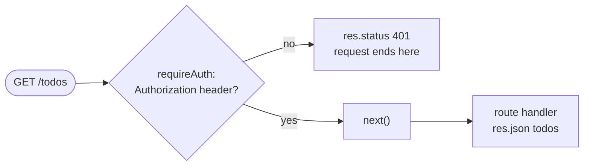

<LessonHeader
  kicker="Express · Lesson 03 of 14"
  minutes={15}
  subtitle={<>The single biggest "aha" in Express - and you've already used its client-side twin.</>}
/>

<Note>
  Quick-reference version of this lesson: [Middleware Cheatsheet →](../cheatsheets/middleware.mdx)
</Note>

<Callout type="react" title="Start from what you know">
  You've written an axios request interceptor before: `axios.interceptors.request.use(config => {...})` -
  a function that runs *before* every request leaves your app, to attach a token or log something.
  Express middleware is the server-side mirror: a function that runs before every request *reaches* your route.
</Callout>

## The shape: (req, res, next)

A middleware function looks almost exactly like a route handler, with one addition - a third parameter, `next`:

```js title="logger.js"
function logger(req, res, next) {
  console.log(`${req.method} ${req.url}`);
  next(); // hand control to whatever comes after this
}
```

<Flow label="Request passes through logger, then express.json, then the route handler">
  <Step type="client">Request arrives</Step>
  <Step>logger middleware</Step>
  <Step>express.json()</Step>
  <Step type="client">Your route handler</Step>
</Flow>

Every middleware runs in the order it was registered, and each one decides: call `next()` to pass
the request along, or send a response (`res.json()` / `res.send()`) to stop it there.

<Callout type="warn" title="The #1 middleware bug">
  Forget to call `next()` (and don't send a response either) and the request just... hangs. The
  client's `fetch()` sits there waiting forever - no error, no timeout by default.
</Callout>

<Flow label="A middleware that forgets next() leaves the request hanging">
  <Step type="client">Request arrives</Step>
  <Step type="warn">middleware forgets next()</Step>
  <Step type="error">...nothing happens, ever</Step>
</Flow>

## Registering middleware: app.use()

Just like routes, middleware is registered top to bottom - and it runs for every request that comes after it in the file:

```js title="index.js" {4-5}
const express = require('express');
const app = express();

app.use(logger);          // custom middleware - runs for every request
app.use(express.json());  // built-in middleware - parses JSON bodies into req.body

app.get('/todos', (req, res) => {
  res.json([{ id: 1, title: 'Learn Express' }]);
});
```

<Callout type="react" title="React analogy">
  `express.json()` is a middleware Express ships for you - like using a library's existing axios
  interceptor instead of writing your own. Without it, `req.body` on a POST request is
  `undefined`, no matter what JSON the client sent.
</Callout>

## Types of middleware, at a glance

| Kind | Registered with | Runs for |
|---|---|---|
| Application-level | `app.use(fn)` | Every request (after this line) |
| Route-level | `app.get(path, fn, handler)` | Only that one route |
| Built-in | `express.json()`, `express.static()` | Whatever you mount it on |
| Third-party | `app.use(cors())`, `app.use(morgan('dev'))` | Whatever you mount it on |

Route-level middleware is just extra functions before the final handler - Express runs each in order, and each must call `next()` to reach the next one:

```js title="index.js"
function requireAuth(req, res, next) {
  if (!req.headers.authorization) {
    return res.status(401).json({ error: 'Not logged in' }); // stop here - no next()
  }
  next(); // logged in, continue to the route handler
}

app.get('/todos', requireAuth, (req, res) => {
  res.json([{ id: 1, title: 'Learn Express' }]);
});
```

Every middleware is a fork in the road - respond and stop, or call `next()` and continue:



<Note>
  This exact pattern - middleware that checks something and either calls `next()` or responds with an error - is how Lesson 12 builds real login-protected routes.
</Note>

## Try it yourself (10 min)

Add this to the top of your `index.js` from Lesson 01/02, above your routes:

```js title="index.js"
app.use((req, res, next) => {
  console.log(`${req.method} ${req.url}`);
  next();
});

app.use(express.json());
```

Restart your server, then make a couple of requests and watch your terminal log each one:

```bash title="terminal"
curl http://localhost:3000/todos
curl -X POST http://localhost:3000/todos -H "Content-Type: application/json" -d '{"title":"test"}'
```

<Callout type="warn" title="Try breaking it on purpose">
  Comment out the `next()` line in your logger and restart the server. Make a request - notice it
  never finishes loading. That's the bug from earlier, happening for real. Put `next()` back when you're done.
</Callout>

## Quick check

<Quiz
  answer={0}
  options={['It hangs forever', 'Express skips it fast', 'The route still runs', 'Node.js crashes hard']}>
  A middleware function never calls `next()` and never sends a response. What happens to the request?
</Quiz>

<Quiz
  answer={0}
  options={['before those routes run', 'after those routes run', 'only on error responses', 'never, only on GET']}>
  Middleware registered with `app.use()` runs relative to the routes defined after it...
</Quiz>

<Quiz
  answer={0}
  options={['req.body gets populated', 'req.params gets populated', 'req.query gets populated', 'res.json gets enabled']}>
  `app.use(express.json())` exists so that...
</Quiz>

## Interview angle

<details>
  <summary>What is middleware in Express?</summary>

  A function with the signature `(req, res, next)` that runs between the request arriving and the
  route handler responding. It can read or modify `req`/`res`, end the request by sending a response,
  or call `next()` to pass control to the next function in the chain.
</details>

<details>
  <summary>Why does the order of `app.use()` calls matter?</summary>

  Express runs middleware and routes in the order they are registered. A middleware only affects
  requests handled by routes registered *after* it - so `express.json()` must come before any route
  that reads `req.body`, and an auth check must come before the routes it protects.
</details>

<details>
  <summary>What's the difference between `app.use(fn)` and `app.get('/path', fn, handler)`?</summary>

  `app.use(fn)` is application-level: it runs for every request (optionally scoped to a path prefix),
  whatever the HTTP method. Passing `fn` before the handler in `app.get` is route-level: it runs only for
  that method and path.
</details>

## Key terms

<Terms>
  <Term name={<code>next()</code>}>Hands control to the next middleware or route in the chain.</Term>
  <Term name="Application-level">Registered with `app.use()`; runs for every matching request.</Term>
  <Term name="Route-level">Passed before the handler in `app.get()` etc.; runs for one route only.</Term>
  <Term name={<code>express.json()</code>}>Built-in middleware that parses a JSON body into `req.body`.</Term>
</Terms>

## Primary source

<Note>
  Watch the middleware section of [Traversy Media's Express Crash Course](https://www.youtube.com/watch?v=CnH3kAXSrmU).
  Reference: [Express.js official "Using Middleware" guide](https://expressjs.com/en/guide/using-middleware.html).
</Note>

<AskBox>
  **Stuck, curious, or want more depth?** Ask your teacher (Claude) anything - "why does order matter for
  middleware but not always for routes," "what's the difference between app.use and app.get with a middleware
  argument," anything at all.
</AskBox>
