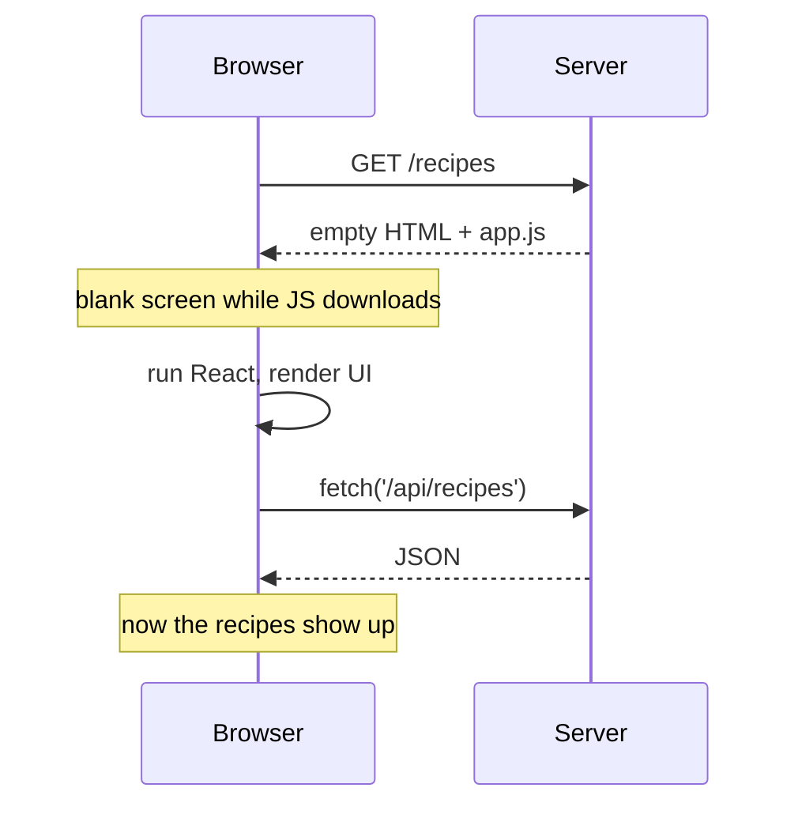
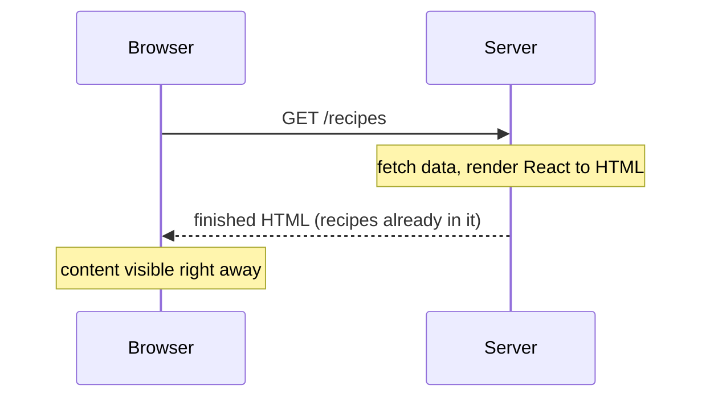
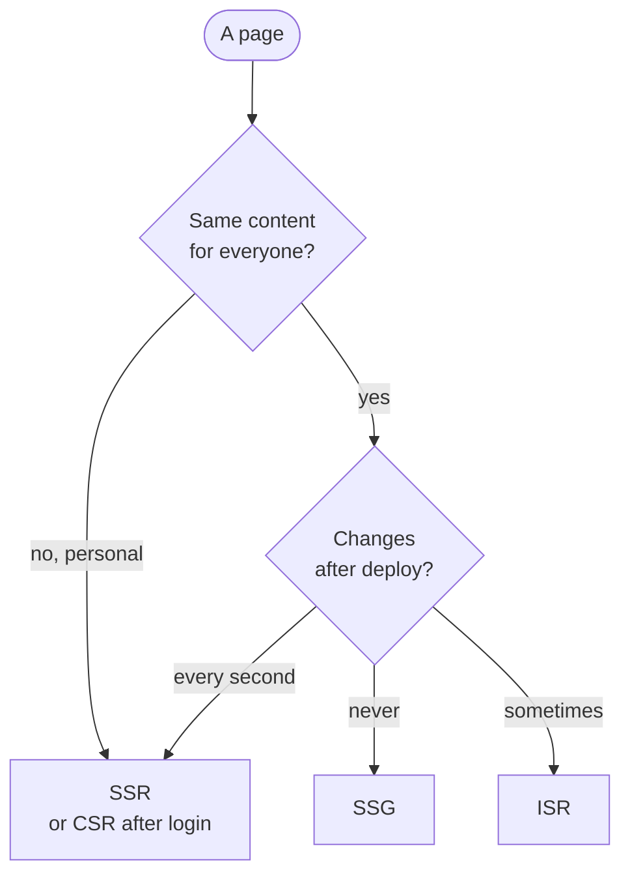

<LessonHeader
  kicker="Next.js · Fundamentals 00a"
  minutes={15}
  subtitle={<>Every rendering choice in Next.js is one of four answers to a single question: <strong>who cooks the HTML, and when?</strong></>}
/>

<Callout type="key" title="Today's win">
  By the end you can look at any page and say whether its HTML was built in the browser, on the server per request,
  or ahead of time, and read the symbols `next build` prints that tell you the same thing.
</Callout>

<Callout type="react" title="Start from what you know">

Open any React app you've built with Vite or Create React App and choose **View Page Source**. You'll see
something like this, and almost nothing else:

```html title="index.html"
<body>
  <div id="root"></div>
  <script type="module" src="/assets/index-3f9a.js"></script>
</body>
```

The HTML is an empty box. Your JavaScript downloads, runs, and *then* builds the page inside `#root`.
That is one of the four answers. Next.js lets you pick a different answer, page by page.

</Callout>

## The restaurant: four ways to get your meal

Think of HTML as a meal. The **kitchen** is the server. **Your table** is the browser.

<CheatGrid>
  <CheatCard title="🍳 CSR" tone="gold" use="Cook at your table. The kitchen hands you raw ingredients and a recipe (JavaScript). Your browser does the cooking." ex="Client-Side Rendering" />
  <CheatCard title="🧑‍🍳 SSR" tone="info" use="Cooked to order. The kitchen cooks a fresh plate for every single order, the moment you ask." ex="Server-Side Rendering" />
  <CheatCard title="🥡 SSG" tone="ok" use="Meal prep. Everything is cooked in advance (at build time) and served straight from the fridge." ex="Static Site Generation" />
  <CheatCard title="⏲️ ISR" tone="warn" use="Meal prep with a refresh timer. Prepped meals get re-cooked in the background after a set time." ex="Incremental Static Regeneration" />
</CheatGrid>

The only two questions that separate them: **where** is the HTML built (browser or server), and **when**
(on each request, or ahead of time).

## 🍳 CSR: cook at your table

This is every React SPA you've written. The server sends an empty page plus a JavaScript bundle; the browser builds the HTML.



- 👍 Great for highly interactive screens behind a login (dashboards, editors).
- 👎 Blank screen until the JavaScript runs; search engines and link previews see an empty box first.

## 🧑‍🍳 SSR: cooked to order

The server runs your React components **for every request** and sends back finished HTML.



- 👍 Always fresh; can be personal to the user (their cookies, their streak).
- 👎 The server does work on every visit, so each response waits for that work.

## 🥡 SSG: meal prep

The HTML is built **once, at build time** (`next build`), then served as a plain file to everyone, often from a CDN close to the user.

<Flow label="SSG: build once, then every visitor gets the same prepared file">
  <Step>`next build` renders the page</Step>
  <Step>HTML file stored (CDN)</Step>
  <Step type="client">Every visitor gets it instantly</Step>
</Flow>

- 👍 The fastest option: nothing to compute when someone visits.
- 👎 Stale until you rebuild. Same page for everyone, so nothing personal.

## ⏲️ ISR: meal prep with a refresh timer

SSG, plus a timer. After the timer runs out, the next visitor still gets the prepped (stale) page instantly,
while the kitchen quietly cooks a fresh batch for everyone after them. This pattern is called
**stale-while-revalidate** ([Next.js ISR guide](https://nextjs.org/docs/app/guides/incremental-static-regeneration)).

<Flow label="ISR timeline with a 60 second timer">
  <Step>Built at deploy</Step>
  <Step type="client">0-60s: served from cache</Step>
  <Step type="warn">After 60s: next visitor gets the old page</Step>
  <Step>Fresh page rebuilt in background</Step>
  <Step type="client">Everyone after sees the new one</Step>
</Flow>

In Next.js that timer is one line in a page file (you'll write it for real in Lesson 14):

<RunsOn where="server" />

```tsx title="app/recipes/page.tsx"
export const revalidate = 60; // re-cook this page at most once every 60 seconds
```

## Side by side

| | 🍳 CSR | 🧑‍🍳 SSR | 🥡 SSG | ⏲️ ISR |
|---|---|---|---|---|
| HTML built **where** | Browser | Server | Server | Server |
| HTML built **when** | After JS loads | Every request | At build time | At build, then on a timer |
| First paint | Slow | Fast | Fastest | Fastest |
| Fresh data | Yes (fetched later) | Always | Only after rebuild | Within the timer |
| Personal per user | Yes | Yes | No | No |
| Recipe Streak page | Your streak graph after login | "Your streak today" | About page | Recipe list |

## Which one should a page use?



<Callout type="info" title="Next.js mixes them, even on one page">
  You don't pick one mode for the whole app. Each page can use a different one, and in Next.js 16 a single page can have a
  prepared **static shell** with fresh parts **streamed** into it ([Rendering Philosophy](https://nextjs.org/docs/app/guides/rendering-philosophy)).
  You'll see streaming in Lesson 05 and the full model in Lesson 14.
</Callout>

## The words the Next.js docs use

The docs rarely say "SSG" or "SSR" for the App Router. Translate like this:

| You'll read in the docs | It means |
|---|---|
| **Static** rendering / **prerendering** | Built ahead of time (SSG, or ISR with a timer) |
| **Dynamic** rendering | Built on each request (SSR) |
| **Revalidate** | Re-cook a prepared page (the ISR timer, or on demand) |
| Client Component doing a `fetch` | The CSR part of a page |

## Try it yourself (10 min)

You don't need a Next.js project yet. Two experiments in Chrome:

1. Open a React SPA you've built (or any Vite demo) and run **View Page Source**. Find the empty `<div id="root">`. That's CSR.
2. Open [nextjs.org](https://nextjs.org) and run **View Page Source**. Search the source for a heading you can see on the page. It's already in the HTML: the server cooked it.
3. Bonus: in DevTools, open the Command Menu (<kbd>Cmd</kbd>+<kbd>Shift</kbd>+<kbd>P</kbd> or <kbd>Ctrl</kbd>+<kbd>Shift</kbd>+<kbd>P</kbd>), run **Disable JavaScript**, and reload both pages. The CSR app goes blank; the Next.js page still shows its content. Turn JavaScript back on after.

<Callout type="warn" title="Why this matters in interviews">
  "Why use Next.js over plain React?" usually has this answer underneath: real HTML on first load means a faster first paint,
  better SEO and proper link previews, which CSR can't give you by default.
</Callout>

## Spot it in the wild

When you run `npm run build` in a Next.js project (default setup), it prints a route table with a symbol per page
([Building guide](https://nextjs.org/docs/app/guides/building)):

```bash title="terminal"
Route (app)
┌ ○ /about
├ ● /recipes/[slug]
└ ƒ /streak

○  (Static)   prerendered as static content
●  (SSG)      prerendered as static HTML (uses generateStaticParams)
ƒ  (Dynamic)  server-rendered on demand
```

`○` and `●` are meal prep (SSG, or ISR if a timer is set). `ƒ` is cooked to order (SSR). In a codebase at work,
this table is the fastest way to see how every page is served.

## Quick check

<Quiz
  answer={0}
  options={['Built in the browser', 'Built at build time', 'Built on each request', 'Built on a set timer']}>
  In a Vite React app, "View Page Source" shows an empty `<div id="root">`. Where is that page's HTML built?
</Quiz>

<Quiz
  answer={0}
  options={['The old cached page', 'A blank loading page', 'An error page first', 'The freshly built page']}>
  An ISR page has a 60 second timer. It's been 90 seconds since it was built. What does the next visitor get?
</Quiz>

<Quiz
  answer={0}
  options={['SSR, cooked to order', 'SSG, meal prepped ahead', 'ISR, prepped with timer', 'CSR with no JavaScript']}>
  A page shows "Welcome back, your streak is 12 days", different for every signed-in user, and must be in the first HTML. Which fits?
</Quiz>

## Interview angle

<details>
  <summary>What's the difference between SSR and SSG?</summary>

  Both produce HTML on the server. SSG renders once at build time and serves the same file to everyone, which is the
  fastest option but stale until the next build. SSR renders on every request, so it's always fresh and can be personal,
  but the server does work on each visit.
</details>

<details>
  <summary>What is ISR, and what does "stale-while-revalidate" mean?</summary>

  ISR is static generation with a revalidation timer (or an on-demand trigger). After the timer expires, the next request
  still gets the cached (stale) page immediately, while Next.js regenerates the page in the background. Once that succeeds,
  later requests get the new page. You get static speed with data that's at most a few seconds or minutes old.
</details>

<details>
  <summary>Why isn't client-side rendering enough for a public website?</summary>

  With CSR the first HTML is an empty container, so users see a blank screen until the JavaScript downloads and runs,
  and crawlers and link-preview bots may see no content at all. Server rendering (SSR, SSG or ISR) sends real HTML
  first, which improves first paint, SEO and sharing.
</details>

## Key terms

<Terms>
  <Term name="CSR">Client-Side Rendering: the browser builds the HTML with JavaScript.</Term>
  <Term name="SSR">Server-Side Rendering: the server builds fresh HTML on every request. The docs call this dynamic rendering.</Term>
  <Term name="SSG">Static Site Generation: HTML built once at build time. The docs call this static rendering or prerendering.</Term>
  <Term name="ISR">Incremental Static Regeneration: static pages rebuilt in the background after a timer or on demand.</Term>
  <Term name="Stale-while-revalidate">Serve the cached copy now, refresh it in the background for the next visitor.</Term>
</Terms>

## Primary source

<Note>
  Read Google's [Rendering on the Web](https://web.dev/articles/rendering-on-the-web) on web.dev, the classic article on these trade-offs.
  Then skim the Next.js view of the same idea: [Rendering Philosophy](https://nextjs.org/docs/app/guides/rendering-philosophy)
  and the [ISR guide](https://nextjs.org/docs/app/guides/incremental-static-regeneration).
</Note>

**Up next:** 00b - Server vs Browser: now that the server can cook HTML, how does that HTML become a clickable React app?

<AskBox>
  **Stuck, curious, or want more depth?** Ask your teacher (Claude) anything: "is my company's dashboard CSR or SSR?",
  "why not just SSR every page?", "how does a CDN fit in?", anything at all.
</AskBox>
